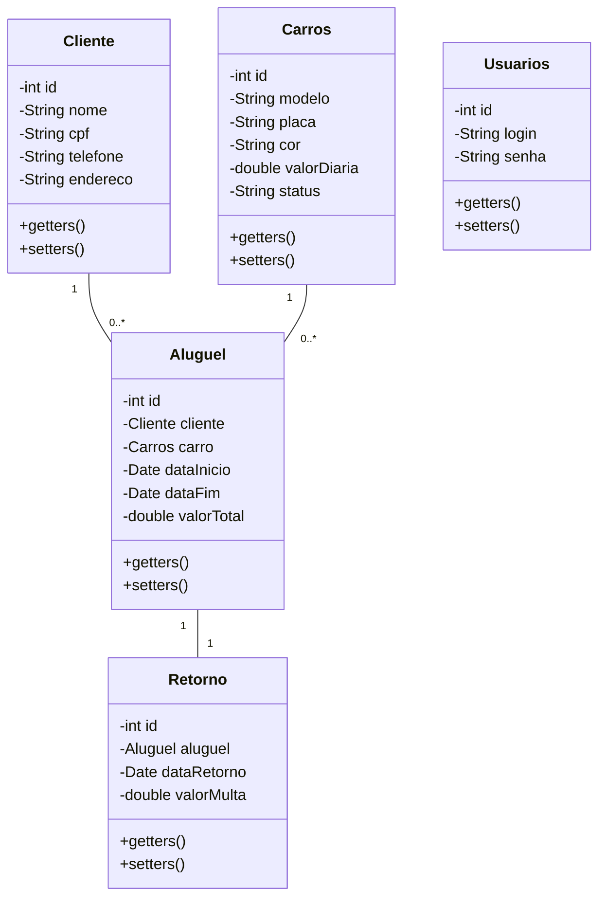
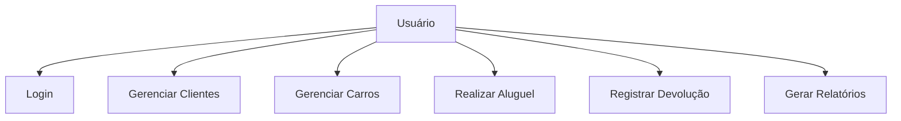

# Sistema de Aluguel de Carros - Godzilla

## 📋 Descrição do Projeto
O Godzilla é um sistema de gerenciamento de aluguel de carros desenvolvido em Java, utilizando uma arquitetura MVC (Model-View-Controller). O sistema permite o gerenciamento de carros, clientes, aluguéis e devoluções, com uma interface gráfica moderna utilizando a biblioteca FlatLaf.

## 🛠️ Tecnologias Utilizadas
- Java 11
- MySQL 8.0
- Maven
- FlatLaf (Interface gráfica)
- iTextPDF (Geração de relatórios)

## 📦 Dependências
- mysql-connector-java (8.0.30)
- flatlaf (1.0-rc2)
- flatlaf-intellij-themes (1.0-rc2)
- itextpdf (5.5.13.1)

## 🏗️ Estrutura do Projeto
```
Godzilla/
├── src/
│   └── main/
│       └── java/
│           ├── controller/     # Controladores da aplicação
│           ├── model/          # Modelos e DAOs
│           │   ├── dao/        # Data Access Objects
│           │   └── entities/   # Entidades do sistema
│           ├── sql/           # Scripts SQL
│           └── view/          # Interfaces gráficas
```

## 📊 Diagrama UML

### Diagrama de Classes


### Diagrama de Casos de Uso


## 📝 Funcionalidades Principais
1. **Gerenciamento de Clientes**
   - Cadastro
   - Edição
   - Consulta
   - Exclusão

2. **Gerenciamento de Carros**
   - Cadastro
   - Edição
   - Consulta
   - Exclusão
   - Controle de disponibilidade

3. **Aluguel de Carros**
   - Registro de aluguéis
   - Cálculo automático de valores
   - Controle de datas

4. **Devolução de Carros**
   - Registro de devoluções
   - Cálculo de multas
   - Atualização de status

5. **Relatórios**
   - Geração de relatórios em PDF
   - Histórico de aluguéis
   - Histórico de devoluções

## 🗄️ Estrutura do Banco de Dados
O sistema utiliza um banco de dados MySQL com as seguintes tabelas:
- tabelaUsuario
- tabelaCarros
- tabelaAluguel
- tabelaRetorno

## 🚀 Como Executar
1. Clone o repositório
2. Configure o banco de dados MySQL
3. Execute os scripts SQL na ordem:
   - tabelaUsuario.sql
   - tabelaCarros.sql
   - tabelaAluguel.sql
   - tabelaRetorno.sql
4. Configure as credenciais do banco de dados no arquivo de configuração
5. Execute o projeto através do Maven:
   ```bash
   mvn clean install
   mvn exec:java
   ```

## 📱 Telas do Sistema
1. **Login**
   - Autenticação de usuários

2. **Tela Principal**
   - Menu de navegação
   - Acesso a todas as funcionalidades

3. **Gerenciamento de Clientes**
   - Interface para CRUD de clientes

4. **Gerenciamento de Carros**
   - Interface para CRUD de carros

5. **Tela de Aluguel**
   - Registro de novos aluguéis

6. **Tela de Retorno**
   - Registro de devoluções

## 🔒 Segurança
- Autenticação de usuários
- Controle de acesso
- Validação de dados

## 📈 Próximas Melhorias
- Implementação de backup automático
- Integração com sistemas de pagamento
- Relatórios mais detalhados
- Dashboard com métricas
